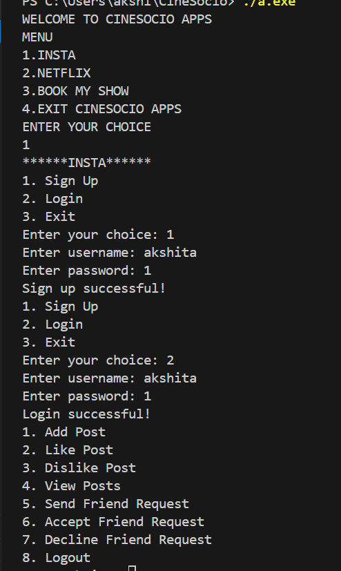
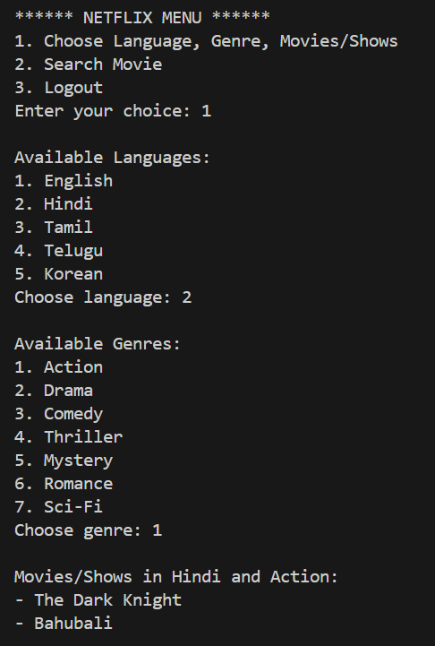
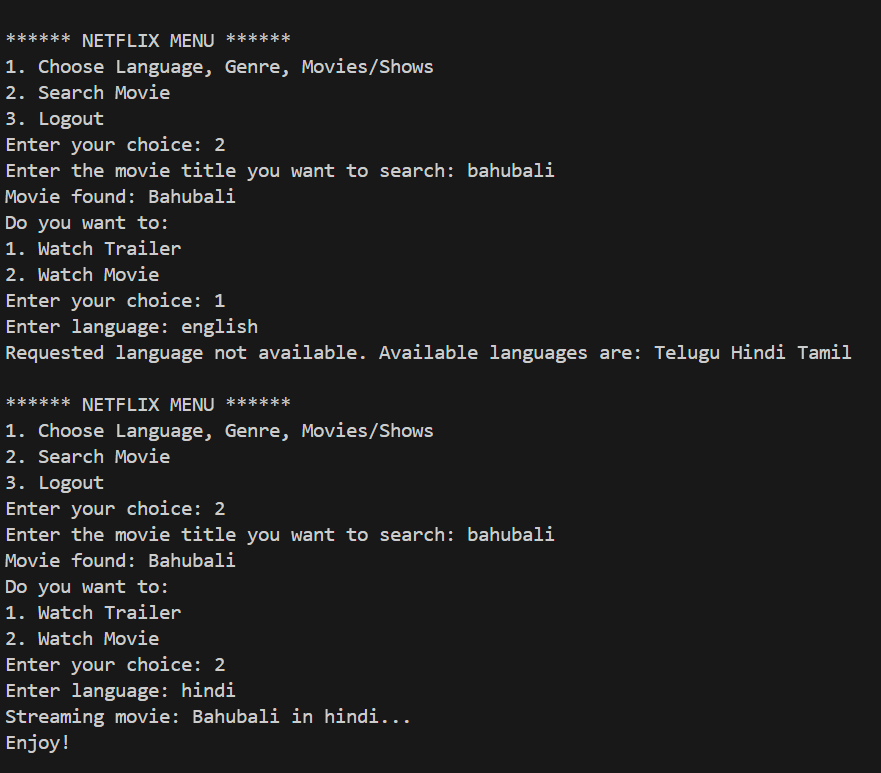
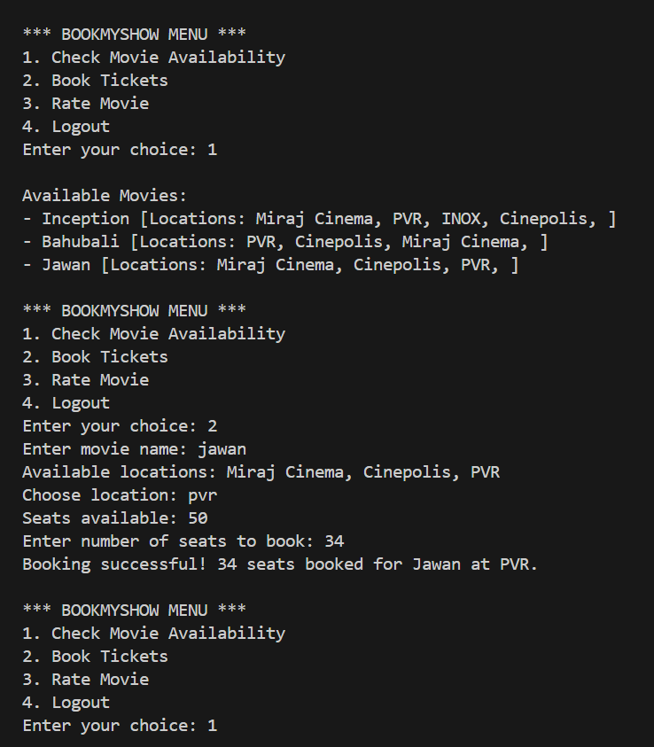
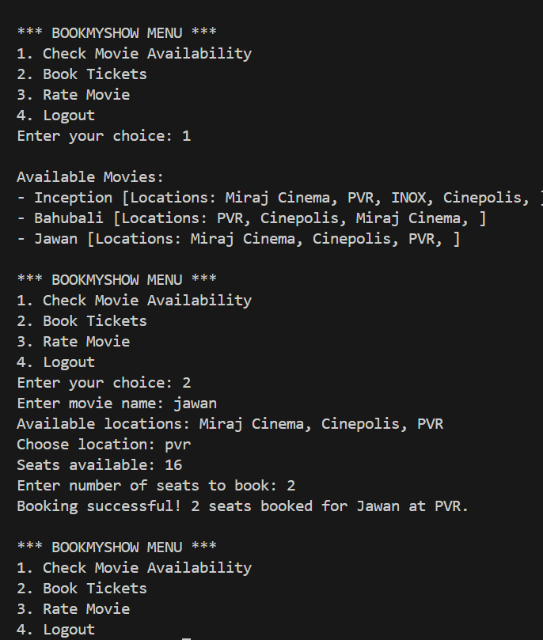
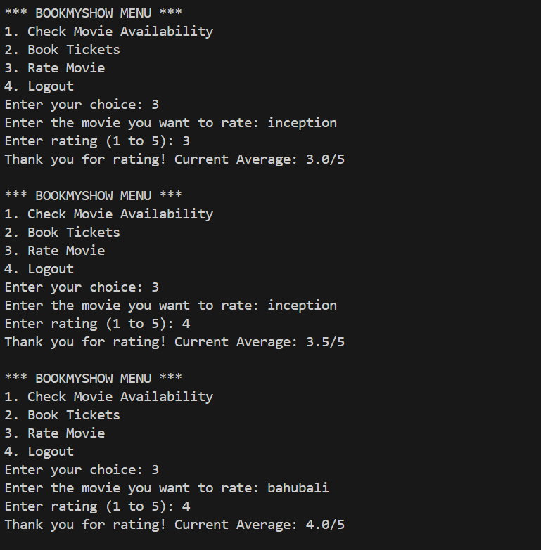

## CineSocio – Console-Based Social & Streaming Platform (C++)

CineSocio is a console-based C++ application that simulates the core backend logic of popular platforms like Instagram, Netflix, and BookMyShow.
The project focuses on object-oriented design, data handling, and user interaction workflows without using any external frameworks.

## Features

# User Authentication

Sign up and login system shared across modules

# Insta Module

Create posts

Like and dislike posts (with duplicate prevention)

Send, accept, and decline friend requests

# Netflix Module

User Authentication: Users can sign up, log in, and log out securely.

Movie Database: Contains predefined movies with title, genre, and available languages.

Filter Movies: Users can select a language and genre to view matching movies.

Search Functionality: Search movies by title and choose to watch trailer or full movie.

Language Check: Verifies if the selected language is available before streaming.

# BookMyShow Module

Implemented movie and location mapping with seat availability tracking

Enforced booking constraints to prevent seat over-allocation

Maintained user-wise booking records

Enabled movie rating system with dynamic average calculation

## Tech Stack

Language: C++

Concepts Used:

Object-Oriented Programming (classes, encapsulation, modular design)

STL (vector, map, algorithm)

File-independent backend logic

Menu-driven application design

## What This Project Demonstrates

Backend-style business logic implementation

User and data flow modeling

Handling state (likes, bookings, ratings, friend requests)

Clean separation of concerns across modules
## 👩‍💻 My Contribution

I contributed to the development of the **CineSocio** console-based C++ project with a focus on
backend logic and object-oriented design.

## Key Contributions:
- Implemented core **C++ classes** using Object-Oriented Programming principles
- Developed **user authentication logic** shared across modules
- Contributed to the **Insta module** (post creation, likes/dislikes, friend request handling)
- Assisted in implementing **Netflix module logic** including filtering, search, and language validation
- Worked on **BookMyShow booking logic**, seat availability checks, and rating calculations
- Helped in **debugging, testing, and improving code flow**
- Contributed to **documentation and README structuring**

## How to Run
g++ cinesocio.cpp -o cinesocio
./cinesocio
